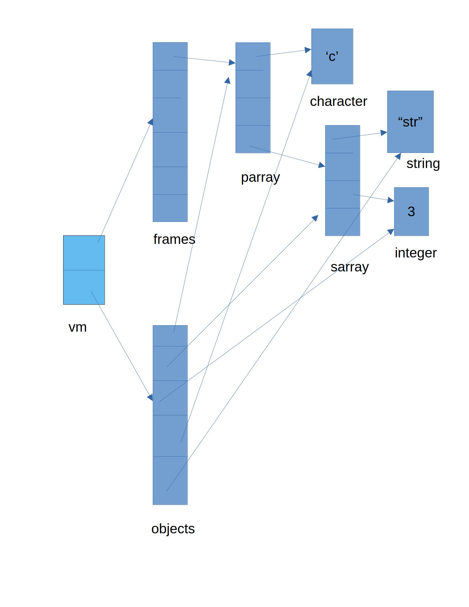

# A Simple Mark N Sweep Garbage Collector Prototype.
### Video Demo: https://youtu.be/yTCzWC_W_bE

## Introduction
<p>
A mark and sweep garbage collector is an algorithm that is used to handle memory for the programmer. There are two popular methods to handle memory.<br>
    1. Reference Counting<br>
    2. Mark and Sweep<br>
This project uses a simple mark and sweep algorithm to handle memory management in a scenario where the following objects are created using C structs.

## Objects
#### objects.c objects.h
The prototype handles the following type of objects.
1) Boolean - Store a boolean value.
2) Character - Store a character.
3) Integer - Store an integer.
4) Real - Store a floating point value.
5) Strings - Store an array.
6) Arrays - Store a collection of different objects, even arrays themselves. Size increases dynamically.
##### Objects and methods related to them.
```c
typedef enum Datatype
{
    BOOLEAN,
    ARRAY,
    CHARACTER,
    REAL,
    INTEGER,
    STRING,
} datatype_t;

typedef union Value
{
    struct Array {
        object_t **arr;
        int capacity;
        int len;
    } array;
    float v_float;
    int v_int;
    char v_char;
    char *v_string;
    bool v_bool;
} value_t;

typedef struct Object
{
    datatype_t datatype;
    value_t value;
    bool is_marked;     /* Set to false initially */
} object_t;

// Constructors.
object_t *get_obj(vm_t *vm);
object_t *get_array(vm_t *vm, size_t capacity);
object_t *get_bool(vm_t *vm, bool value);
object_t *get_char(vm_t *vm, char value);
object_t *get_float(vm_t *vm, float value);
object_t *get_int(vm_t *vm, int value);
object_t *get_string(vm_t *vm, char *str);

void print_obj(object_t *obj);
int len(object_t *obj);

// Array functions.
bool set_array(object_t *obj, int index, object_t *src_obj);
object_t *get_element(object_t *obj, int index);

void free_obj(object_t *obj);
```

## Data Structure
#### stack.c and stack.h

The project uses stacks to efficiently track every object and its lifetime. The stack can push and pop any generic object using void* pointers. It has the following fields and functions.
```c
#include <stddef.h>
typedef struct Stack
{
    size_t top;
    size_t capacity;
    void **data;
} stack_t;

stack_t *get_stack(size_t capacity);
void push(stack_t *stack, void *obj);
void *pop(stack_t *stack);
void stack_remove_nulls(stack_t *stack);
void free_stack(stack_t *stack);
```

---
## GC Implementation
Heart of the GC implementation.
#### Files: vm.c and vm.h
```c
// A VM is a container that has stack of frames and stack of objects.
typedef struct VM {
    // frames is a stack of stacks.
    stack_t *frames;
    stack_t *objects;
} vm_t;

// A frame is a stack of references.
typedef struct Frame {
    // Objects that a frame references.
    stack_t *references;
} frame_t;

vm_t *create_vm();
void free_vm(vm_t *vm);
// A wrapper function to push only frames into the vm.
// Avoid direct pushing into the frames stack.
void vm_push_frame(vm_t *vm, frame_t *frame);
frame_t *get_frame(vm_t *vm);
void free_frame(frame_t *frame);

void vm_track_object(vm_t *vm, object_t *obj);
void frame_reference_obj(frame_t *frame, object_t *obj);

void mark(vm_t *vm);
void trace(vm_t *vm);
void trace_blacken_object(stack_t *grey_objects, object_t *obj);
void trace_mark_object(stack_t *grey_objects, object_t *obj);
void sweep(vm_t *vm);
void run_gc(vm_t *vm);
```

1. **VM Structure**
    The VM (vm_t) structure contains two essential stacks:
        1. frames: A stack to hold frames, which manage references to objects.
        2. objects: A stack for tracking all the allocated objects within the VM.
<br>

2. **Frame Structure**
    Each frame (frame_t) has a stack of references to objects that it manages. This allows efficient tracking of root objects in use during the mark phase of GC.
<br>

3. **Creating and Freeing the VM**
    The create_vm function initializes a new vm_t instance, setting up both the frames and objects stacks.
    The free_vm function deallocates the resources used by the VM, ensuring that all frames and objects are properly released.
<br>

4. **Managing Frames**
    The vm_push_frame function provides a safer way to push frames onto the frames stack, preventing direct manipulation of the stack. This is used as a wrapper function in get_frame to push the frame to the frames stack of the vm soon after creating the frame.
    get_frame retrieves the current frame from the stack, while free_frame deallocates a frame, ensuring all contained references are released.
    free_frame can be called after a function returns i.e the stack frame of the function is popped.
<br>

5. **Object Tracking**
    The vm_track_object function is responsible for adding an object (object_t) to the objects stack, ensuring it's monitored by the garbage collector.
    The frame_reference_obj function pushes the object into the **references** stack of the given frame allowing the garbage collector to find the root objects.
<br>

6. **Mark Phase**
    The mark function initiates the marking phase of the garbage collection. It iterates through all active frames and marks each object directly referenced by them, indicating that they are still in use. The objects marked in this phase are called the root objects.
<br>

7. **Trace Functions**
    trace, trace_blacken_object, and trace_mark_object handle the traversal of the object graph, marking all reachable objects. This ensures that the garbage collector can identify all objects that are still needed and prevent them from being collected.
    grey_objects stack initally contains the root objects of every frame.
    **trace_blacken_object** is called on every popped object and will now cause the gray_objects to contains all the objects that will be collected by traversing the root object. If suppose the root references an array, **trace_mark_object** is called on every object that it references which marks the object and pushes the object to grey_objects stack. Otherwise, the function returns since there are no further referenced objects(eg. boolean)

    This means that if an array that contains all the objects is directly referenced by a frame, all the referenced objects will marked automatically during trace phase.
<br>

8. **Sweep Phase**
    The sweep function traverses the objects stack and frees any objects that are not marked, effectively reclaiming memory that is no longer in use.
<br>

9. **Running Garbage Collection**
    The run_gc function starts the garbage collection process by calling the mark, trace, and sweep functions in sequence and sets up the objects for next GC cycle.

## Memory Model


---
## Critic

1) *Array objects allow random indexing which can increase the memory footprint if used unethically. A case could be when you repeatedly insert objects to the last index which triggers memory reallocation.*
**Solutions**
    *1. Remove random indexing feature.
    2. Catch such cases during compilation. If this project were used for a programmign langugage.
    3. Provide fixed sized arrays.*
2) *For an object to be tracked by the VM it has to be either referenced by an object that is already pushed into the frame or the object itself has to be directly referenced by a frame by calling **frame_reference_obj(frame, obj)**
This could be automated/optimized during the object creation itself.*

---
## Important Outcomes
*In any language that provides a GC feature, it is important as the programmer to keep in mind the way we create and use objects. Creating objects unnecessarily means larger GC time consumption. GC for any software is complementary. It has to run efficiently in the background handling memory i.e it must consume as little CPU cycles as possible. Creating unncessary objects means that the GC has to look if is a root object or if it can reference other objects(in case of arrays) which takes CPU cycles.*

---
## Conclusion
*This is a working prototype of a mark and sweep based garbage collector that can handle cycles, trace root objects, trace referenced objects and free objects that are not referenced in the GC cycle. It also sets up the objects for the next GC cycle by setting the is_marked flag for every object to false.*

---
## Special Thanks To
TJ DeVries & Boot Dev - https://www.youtube.com/watch?v=rJrd2QMVbGM

David J Malan - Course Instructor.

CS50x 2025 Team - https://www.youtube.com/@cs50</i>
